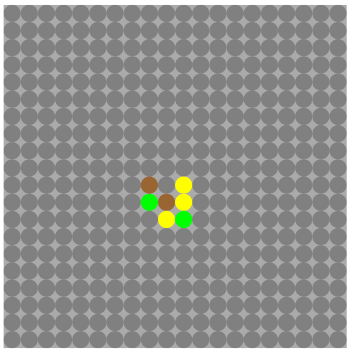
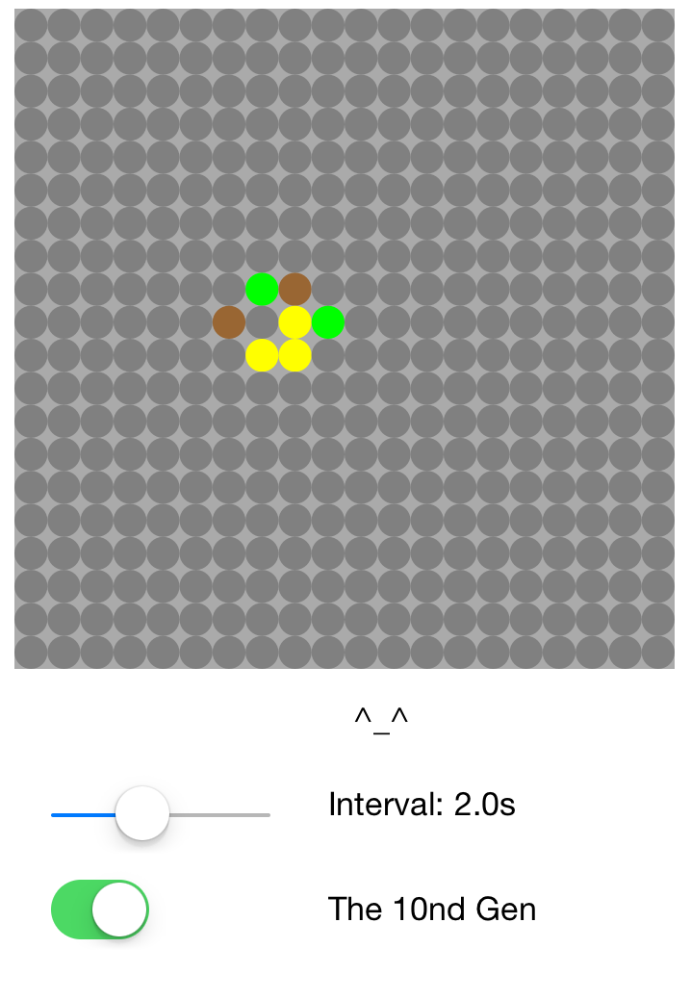

## Peng He S65 HW2

#### 1. (5 pts) How is the Application Delegate different from all other delegates?

An application delegate is a special delegates because it triggers when the application is opened, closed or terminated with some iOS alerts. It is very important to have it supervise the application status and response to the application status it is facing.

#### 2.(10 pts) For closures that are:
a. Stored as a property in a class instance;
b. Therefore, automatically capture self of that class;
**why is it important that they explicitly capture self as weak or unowned**?

Because only by declare the closure with a capture list to be a weak or unowned reference, it is allowed to deallocated the instance when it becomes nil. The reason is that a closure stores as a property in a class and has some self.method, which catches itself, will build a **strong** connection to the instance. On the other hand, the instance holds a **strong** reference to the closure as well. They become a two-way strong connection and will not delete the space when assigning the instance to be `nil`.

#### 3.  (12 pts) The UIPicker
###### Consider a typical arrangement of a UIPicker within a UIViewController. The UIPicker is an Outlet (specified with the @IBOutlet attribute) which StoryBoard declares for you automatically as a weak reference. Now assume the UIPicker’s stored delegate property has been set to the self of the ViewController instance – assume this happened at a typical time such as in viewDidLoad() or in the didSet observer of the UIPicker reference. Draw a box-and-pointer diagram showing the reference cycle that’s avoided by declaring the reference to the UIPicker as weak.


See picture 

#### 4. (4 pts) Why is it that adding UIPickerDataSource to the protocol list of a class cause an immediate compiler error, whereas adding UIPickerViewDelegate does not? For the sake of the question, assume the class starts off with no function members.

The apple document says about the dataSource :

	The data source must adopt the UIPickerViewDataSource protocol and implement the required methods to return the number of components and the number of rows in each component.

That is you need implement the required method for it and then the compiler err will go away. The UIPickerViewDelegate does not require that.

#### 5. (6 pts) What’s a better solution?
###### Suppose there was a generic (non-iOS) Swift class where the value of a property p was completely determined by the values of 3 other properties. One way of keeping p current is to make 3 didSet property observers: one for each dependent property, and recalculate p in each case. However this quickly becomes tedious. What’s a better solution? Assume that the calculations used to compute p are quick and lightweight in memory usage.

Can we set p as a computed property and call it when use, the iOS when give us the results. I’m not sure about this.


#### 6. (8 pts) Research the web to show how to convert a number to its hexadecimal notation as a String. 
###### As always show your citation. Do the same for the reverse: parse a String representation of a hexadecimal number. Wrap the code you find/write in an extension to the Int class and call the method fromHexString. What String represents the largest hexadecimal value you can parse and store correctly, assuming the result must be stored in an Int (signed, 64-bit integer)? Show your function working with a few test cases. You may assume you are not parsing any ‘-‘ (negative) signs or non-integral values when parsing the String.

See code in playground

Cites:

[how-to-convert-a-decimal-number-to-binary-in-swift](http://stackoverflow.com/questions/26181221/how-to-convert-a-decimal-number-to-binary-in-swift)

[swift-native-functions-to-have-numbers-as-hex-strings](http://stackoverflow.com/questions/27189338/swift-native-functions-to-have-numbers-as-hex-strings)

[9223372036854775807](https://en.wikipedia.org/wiki/9223372036854775807)

#### 7. (5 pts) Does the call to setNeedsDisplay directly invoke drawRect in its call chain, or is it scheduled for later? When?
It will scheduled for later, the next drawing cycle and then update the view. 

Cite: 

[setNeedsDisplay](https://developer.apple.com/library/prerelease/ios/documentation/UIKit/Reference/UIView_Class/#//apple_ref/occ/instm/UIView/setNeedsDisplay)

#### 8. (5 pts) What happens when the “:” is left out of the selector string in the NSTimer initialization? What does the “:” indicate?
	
	The selector should have the following signature: timerFireMethod: (including a colon to indicate that the method takes an argument). The timer passes itself as the argument, thus the method would adopt the following pattern
	
```
(void)timerFireMethod:(NSTimer *)timer
```

According to apple development doc, a colon means the method takes an argument, which is `handleTimer(timer: NSTimer)` .
If the `:` is left our, the program will crash because no right method could be found. 


#### 9. (6 pts) The given code has a notification sent in response to the ApplicationWillResignActive event. When the ViewController receives this event, it responds by canceling the repeating timer via invalidate(). Why is this unnecessary?

The iOS will pause the App anyway. A game program should save its resource such as graphic and user data, when this method being called. Also, program should stop its timer. 

#### 10. (10 pts) It would have been convenient to attach UIColors as rawValues to the enum in CellGridModel. (If we did so there’s a particular property in a particular class that could be dispensed with – point it out). Why did we scrupulously avoid doing so?

Not quite understand this question. 

The magic number is always bad if you hard code color in the enum. For this enum, the thing it returns is a method call belongs to UIColor. May be too much copy of enum will eats memory,; however, I don’t know why the reason to use rawValues but it is very easy to understand in the way it is now.

#### 11. (3 pts) In ModelBasedGridView, why must we prefix cellDim and drawRect with override?

Because I think there are another version of cellDim in CGPoint and drawRect() in CGRect class.

#### 12. (2 pts) What happens if you change cellPath.fill() to cellPath.stroke()?

It will color the stroke instead of filling the cell.

#### 13. (6 pts) Change the squares to circles. Use the UIBezierPath(arcCenter: …) constructor. 

	Hints: See the UIBezierPath reference in the Apple Docs. As the center, use the center of the CGRect that is calculated currently; the radius should be easy to calculate; angles are measured in radians, so that 2*pi = 360 degrees; since you’re going all the way around, it doesn’t really matter at what angle you start as long as you end there, and drawing direction doesn’t matter.

```
let arcCenter  = CGPoint(x: CGFloat(x) * cellDim.x + CGFloat(cellDim.x / 2), y: CGFloat(y) * cellDim.y + CGFloat(cellDim.y / 2))

let radius  = CGFloat(cellDim.x / 2)

let cellPath : UIBezierPath = UIBezierPath(arcCenter: arcCenter, radius:CGFloat(radius), startAngle: CGFloat(0), endAngle: CGFloat(M_PI*2), clockwise: true)
```

#### 14. (15 pts) Add a slider directly beneath that controls the time interval between calculations. Lay out the slider directly below the grid. Let it range from 0.1 to 5 seconds. The visual update pacing should track the slider as it is dragged, not just when it is released (‘Touch Up’).

See code

#### 15. (10 pts) Add a text label just to the right of the slider that shows the time interval currently selected. It should also update as the slider is dragged.

See Code

#### 16. (5 pts) Add a text label below the slider that shows what generation the simulation is on. It should in sync with the actual generation shown. (Technically it’s impossible to do this with super-high precision since it’s up to iOS to actually schedule the redraws of different elements; however the requests to make the visual updates should be together in the code.)

See Code

#### 17. (8 pts) Add an ‘Active’ toggle (UISwitch) that controls whether the animation is active or paused. It’s alright if it doesn’t take effect until the next scheduled timer has gone off.

See Code

